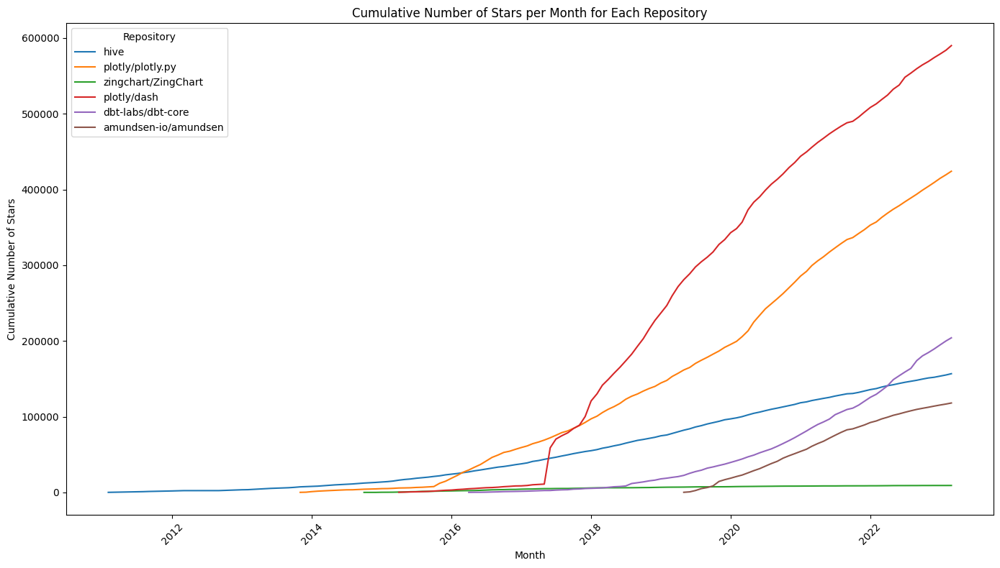

# GitHub Gems: Driving Open-Source Investments With Data

Welcome to the GitHub Gems project! This project hosts a data analytics pipeline that enables smarter investment decisions by measuring the popularity of open-source repos on Github.

## Project Overview

The goal of this project is to develop an efficient data pipeline that streamlines analytics, reduces manual effort, and enables deeper insights into the open-source ecosystem on GitHub. By leveraging modern data tools and best practices, such as dbt (data build tool) and Jinja, we aim to create a scalable and reliable solution for data-driven decision-making.

## Charts and Graph

### Lineage Graph


### Sample Chart 1: Cumulative Number of Stars per Month for Each Repository


### Sample Chart 2: Year-to-Year Growth of Stars per Month for Each Repository


## High-Level Features

### Most Important Metrics and Data Points

- **Growth Rate of Stars:** This metric indicates how quickly the number of stars on a repository is increasing.
- **Growth Rate of Commits:** This metric measures the speed at which new commits are being made to a repository.
- **Custom Analysis:** This allows for the implementation of custom metrics or analysis tailored to specific project requirements.

### Source Data

The project utilizes data from the GH Archive, a third-party source, due to its advantages of simple load logic compared to GitHub's native data. GH Archive offers timely updates, refreshing every hour, and we update our data daily to ensure the latest information is utilized. To mitigate risks associated with third-party data sources, we implement rigorous data quality tests.

### Data Format

The data is delivered in the form of SQL databases.

### Update Frequency

The data is updated daily to maintain up-to-date information for analysis.

## Model

In this project, we will be utilizing the **Kimball Model**, aka "Star Schema."

### Facts and Dimension Tables

#### Facts: 

- **fact_Stars:**
  - event_id (PK)
  - repo_id
  - user_id
  - event_date

- **fact_Commits:**
  - event_id (PK)
  - repo_id
  - user_id
  - event_date

#### Dimensions: 

- **dim_Repositories:**
  - repo_id (PK)
  - repo_name
  - owner_login (FK)

- **dim_Users:**
  - user_id (PK)
  - login


### Sample SQL Code

Here are some sample SQL queries demonstrating the growth rate of stars and commits for a specific repository:

Sample Code for Growth Rate of Stars
```sql
SELECT month, yoy_growth
FROM repo_stars_growth
WHERE repo_name = "plotly/plotly.py"
```

Sample Code for Growth Rate of Commits
```sql
SELECT month, yoy_growth
FROM repo_commits_growth
WHERE repo_name = "plotly/plotly.py"
```